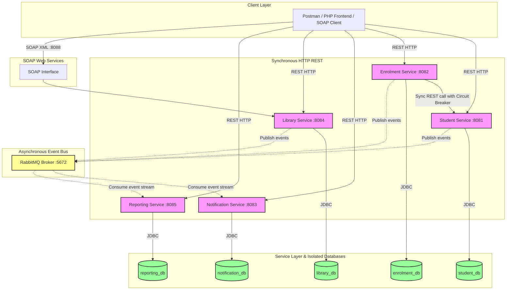
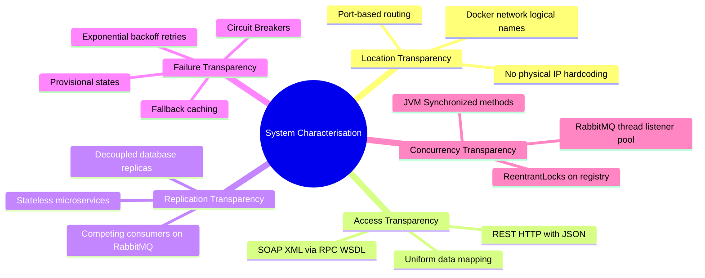

# SmartCampus Connect

SmartCampus Connect is a distributed, service-oriented university campus administration platform. Built as a collection of independent microservices, it enables administration of students, course enrolments, library resources, real-time notifications, and centralized reporting/analytics.

---

## 1. Project Overview

### Description
SmartCampus Connect is a distributed backend platform designed to manage campus administration services. It comprises five independent, modular Spring Boot microservices that communicate using both synchronous RESTful HTTP calls and asynchronous event-driven messaging via RabbitMQ. The system enforces database-per-service isolation to ensure service autonomy, uses JAX-WS for SOAP integration, and is containerized using Docker for deployment.

### Problem Statement
Traditional university IT environments rely on monolithic architectures where student records, course enrolments, library databases, and notification systems are tightly coupled. This architecture introduces critical vulnerabilities:
* **Single Point of Failure (SPOF):** A crash in one module (e.g., heavy traffic during course registration) takes down the entire system, disabling unrelated services like library bookings or student profile updates.
* **Scalability Bottlenecks:** Monoliths must be scaled as a single unit, which is resource-inefficient when only specific services experience high loads.
* **Synchronous Coupling:** Blocking synchronous calls between services propagate failures, leading to cascading system-wide downtime.

### Objective
* **Decouple Services:** Establish a modular microservice architecture with independent deployability and strict Database-per-Service isolation.
* **Enable Hybrid Communication:** Use synchronous REST (via HTTP/JSON) for transactional workflows requiring immediate validation, and asynchronous messaging (via RabbitMQ/AMQP) for non-blocking notifications and reporting.
* **Implement Fault Tolerance:** Build resilient communication channels using custom timeout controls, retry mechanisms with exponential backoff, and circuit breaker patterns to prevent cascading failures.
* **Ensure High Concurrency:** Guard shared mutable state across thread boundaries using JVM synchronization and explicit ReentrantLocks to support high-throughput event processing.
* **Support Heterogeneous Integration:** Expose both REST and SOAP (JAX-WS) interfaces to demonstrate multi-protocol interoperability.

---

## 2. Team Members

### Role Assignments

1. **Team Lead**
   - **Responsible Member:** Syahmi Dhabit Al Hafiz Bin Sesham
   - **Description Role:** Responsible for coordinating meetings, managing the project backlog, monitoring team progress, and maintaining the team charter.

2. **Architect**
   - **Responsible Member:** Aina Maisarah Binti Azman
   - **Description:** Responsible for designing the system architecture, determining suitable architectural patterns, and managing service contracts and technical structure.

3. **Backend/Services Engineer**
   - **Responsible Member:**
     - Muhammad Syahmi Bin Mohamad Saidi (SOAP Service)
     - Abdul Aziz Bin Abd Razak (REST Service)
   - **Description Role:** Responsible for developing and maintaining REST and SOAP service implementations, including backend functionality and API integration.

4. **Concurrency/Messaging Engineer**
   - **Responsible Member:** Fiona Esther Bong
   - **Description:** Responsible for handling the threading model, producer–consumer implementation, and message–bus or messaging integration within the system.

---

## 3. Technology Stack

### Backend
* **Java 17 (JDK 17):** The core programming language.
* **Spring Boot 3.2.x:** The framework for building independent RESTful microservices.
* **Spring Data JPA:** For object-relational mapping and database interactions.
* **JAX-WS (Jakarta XML Web Services):** Used to publish the SOAP web service endpoints in the Library Service.

### Database
* **MySQL:** The primary relational database used in production and local development, configured with database-per-service isolation (individual databases for each service).
* **H2 Database:** Used as an in-memory database for local testing and fallback configurations.

### Messaging
* **RabbitMQ (AMQP 0-9-1):** The message broker handling asynchronous, decoupled communications. It utilizes topic exchanges, dedicated queues, and dead-letter exchanges.

### Testing
* **Postman:** Used for end-to-end integration testing and validation of REST endpoints.
* **Custom Java Load Tester:** A multi-threaded test client designed to assert system concurrency boundaries under load.

### Tools
* **Apache Maven:** For dependency management and project build automation.
* **Docker & Docker Compose:** For containerizing microservices and orchestrating multi-container environments.
* **Laragon / XAMPP:** For running and administering local MySQL and web servers.
* **Eclipse IDE / VS Code:** The integrated development environments.

---

## 4. System Architecture Diagram

The system architecture comprises a client layer, a service layer with database-per-service isolation, a synchronous inter-service REST interface, and an asynchronous event-driven messaging backbone.



---

## 5. Service List

| Service Name | Host Port | Database Schema | Communication Style | Core Responsibilities |
|---|---|---|---|---|
| **Student Profile Service** | 8081 | `student_db` | REST (Sync), RabbitMQ Publisher (Async) | Manages student profiles, handles CRUD operations, and publishes student creation and update events. |
| **Course Enrolment Service** | 8082 | `enrolment_db` | REST (Sync), REST Client (Sync), RabbitMQ Publisher (Async) | Processes course enrolments, maintains course capacities, verifies student status, implements custom circuit breaker and retries, and publishes enrolment events. |
| **Notification Service** | 8083 | `notification_db` | REST (Sync), RabbitMQ Consumer (Async) | Consumes events from the message broker, logs notifications, manages notification history, and implements thread-safe event logging. |
| **Library Service** | 8084 (REST) <br> 8088 (SOAP) | `library_db` | REST (Sync), SOAP RPC (Sync), RabbitMQ Publisher (Async) | Handles book loans and discussion room bookings, publishes loan and booking events, and exposes JAX-WS SOAP operations. |
| **Reporting Service** | 8085 | `reporting_db` | REST (Sync), REST Client (Sync), RabbitMQ Consumer (Async) | Consumes campus events to build aggregated analytics (enrolments per program) and probes the status of active services. |
| **RabbitMQ Message Broker** | 5672 (AMQP) <br> 15672 (Admin) | N/A | AMQP | Decouples services by routing published events to registered queues using topic routing keys. |

---

## 6. Database Relationship Diagram

Since the system adheres to the Database-per-Service pattern, there are no physical foreign key constraints between databases. Instead, relationships are maintained logically using identifier fields (`studentId` and `bookId`).


---

## 7. Service Workflow Diagram

This sequence diagram illustrates the workflow of a course enrolment, showcasing synchronous validation, circuit breaker logic during partial outages, and asynchronous event propagation.


---

## 8. System Characterisation Diagram

Distributed systems characteristics are addressed in the platform to ensure transparency and reliability.



### Explanation of Transparencies

1. **Location Transparency:** Clients and services interact through logical identifiers and ports rather than physical IP addresses. Under Docker, services are addressed using container names (e.g., `http://student-profile-service:8081`), which are dynamically resolved by the internal Docker DNS.
2. **Access Transparency:** The platform exposes uniform interfaces regardless of the programming models or databases used. Clients access the systems using standard REST/JSON over HTTP or SOAP/XML over HTTP via standard WSDL contracts.
3. **Replication Transparency:** Multiple instances of a service can run in parallel. When a message is published to RabbitMQ, it is processed by one of the competing consumer instances in a load-balanced fashion without the publisher knowing which instance handled the event.
4. **Failure Transparency:** Component failures are hidden from the user where possible. If the Student Profile Service is down, the Course Enrolment Service handles the failure using circuit breakers, retries, and fallback to local cache/provisional state, allowing the transaction to complete.
5. **Concurrency Transparency:** Multiple concurrent requests are processed without interfering with each other. Concurrency controls (methods and locks) prevent race conditions on shared database records and in-memory counters.

---

## 9. How To Run

## Prerequisites

Before running the project, ensure the following software is installed:

- Java JDK 17
- Apache Maven
- Docker Desktop
- Laragon or XAMPP
- Git (Optional)
- VS Code or Eclipse IDE (Optional)

---

## Step 1: Get the Project

### Option 1: Download ZIP (Recommended for First-Time Users)

1. Download the project as a ZIP file from GitHub.
2. Extract the ZIP file to your preferred location.

### Option 2: Clone the Repository

If you have Git installed, clone the repository using:

```bash
git clone https://github.com/<your-username>/SmartCampusConnect.git
cd SmartCampusConnect
```

---

## Step 2: Start MySQL

1. Open **Laragon** or **XAMPP**.
2. Start the **MySQL** service.
3. Log in to **phpMyAdmin** (`http://localhost/phpmyadmin`).
4. Ensure MySQL is running before executing `.\run.ps1`. The application will automatically create the required databases and tables during startup.

---

## Step 3: Start Docker Desktop

1. Open **Docker Desktop**.
2. Wait until Docker Desktop shows **Running**.

If Docker Desktop cannot start or displays an error such as:

```text
Virtualization support not detected
```

follow these steps:

1. Restart your computer and enter the **BIOS/UEFI** settings.
2. Enable **Virtualization**:
   - **Intel:** Intel VT-x or Intel Virtualization Technology
   - **AMD:** SVM Mode
3. Save the changes and restart your computer.
4. Open **PowerShell as Administrator** and install **WSL2**:

```powershell
wsl --install
```

5. Restart your computer after the installation is complete.
6. Open **Docker Desktop** again and wait until it shows **Running**.

---

## Step 4: Verify Java and Maven

Open **PowerShell** or **Command Prompt** and run:

```bash
java -version
mvn -version
```

Both commands should display their installed versions.

Example:

```text
java version "17.x.x"
Apache Maven 3.9.x
```

---

## Step 5: Build the Project

Open **PowerShell** in the project directory and run:

```powershell
Set-ExecutionPolicy -Scope Process Bypass
.\build.ps1
```

Wait until the following message appears:

```text
BUILD SUCCESS
```

---

## Step 6: Run the Project

Run the following command:

```powershell
Set-ExecutionPolicy -Scope Process Bypass
.\run.ps1
```

Wait until all Spring Boot services start successfully.

### Service Ports

Once running, the components are accessible at the following addresses:

| Service / Component | Protocol | Port | URL / Endpoint |
|---|---|---|---|
| **Student Profile Service** | REST | 8081 | `http://localhost:8081/api/students` |
| **Course Enrolment Service** | REST | 8082 | `http://localhost:8082/api/enrolments` |
| **Notification Service** | REST | 8083 | `http://localhost:8083/api/notifications` |
| **Library Service (REST)** | REST | 8084 | `http://localhost:8084/api/loans` |
| **Library Service (SOAP)** | SOAP | 8088 | `http://localhost:8088/ws/library?wsdl` |
| **Reporting Service** | REST | 8085 | `http://localhost:8085/api/reports/enrolment-summary` |
| **RabbitMQ Administration UI** | HTTP | 15672 | `http://localhost:15672` (Credentials: `guest`/`guest`) |
| **RabbitMQ Message Broker** | AMQP | 5672 | `amqp://localhost:5672` |
| **Local MySQL Database** | JDBC | 3306 | `localhost:3306` (Credentials: `root`/`no-password`) |

---

## Step 7: Run the Frontend

1. Open the **frontend** folder.
2. Run **index.php** using Laragon or XAMPP.
3. Open the frontend in your browser using the local URL provided by your local server.

---

## Step 8: Access the APIs Using Postman

If you receive the following error in Postman:

```text
Error: connect ECONNREFUSED
```

it means the backend services are not running.

### Run Each Service Manually

1. Open **Eclipse IDE**.
2. Go to **File → Open Projects from File System**.
3. Select the **SmartCampusConnect** project folder.

Run the following applications one by one:

- **StudentServiceApplication.java**
- **EnrolmentServiceApplication.java**
- **LibraryServiceApplication.java**
- **NotificationServiceApplication.java**
- **ReportingServiceApplication.java**

For each application:

1. Right-click the `*Application.java` file.
2. Select **Run As → Java Application**.

### Import the Postman Collection

1. Open **Postman**.
2. Click **Import**.
3. Select:

```text
postman/SmartCampus_Connect.postman_collection.json
```

4. Click **Import**.
5. You can now test all available API endpoints.

---

## Troubleshooting

### `java` is not recognized

Install **Java JDK 17** and ensure it has been added to the system **PATH**.

### `mvn` is not recognized

Install **Apache Maven** and add the Maven **bin** directory to the system **PATH**.

### PowerShell Blocks `.ps1` Scripts

Run:

```powershell
Set-ExecutionPolicy -Scope Process Bypass
```

Then execute the script again.

### Docker Desktop Cannot Start

- Enable **Virtualization** in BIOS.
- Open **PowerShell as Administrator** and run:

```powershell
wsl --install
```

- Restart your computer.
- Open Docker Desktop again.

---

## Technologies Used

- Java 17
- Spring Boot
- Spring Data JPA
- Maven
- MySQL
- Docker
- PHP
- Bootstrap
- Postman
- Eclipse IDE
- VS Code

---

## 10. Concurrency Evidence

The system implements strict thread-safety controls to handle concurrent operations across microservices, verified using a load testing tool.

### ExecutorService (Client-side Load Test)
The load-testing client (`LoadTestClient.java`) simulates high concurrent activity by spawning 50 threads using `ExecutorService` to publish 50 messages simultaneously to the RabbitMQ broker, coordinating startup and completion using a `CountDownLatch`.

```java
// ExecutorService configuration in LoadTestClient.java
ExecutorService threadPool = Executors.newFixedThreadPool(CONCURRENT_REQUESTS);
CountDownLatch latch = new CountDownLatch(CONCURRENT_REQUESTS);

for (int i = 1; i <= CONCURRENT_REQUESTS; i++) {
    final int requestId = i;
    threadPool.submit(() -> {
        try {
            // Build and publish CampusEvent to RabbitMQ exchange
            CampusEvent event = CampusEvent.of(
                    RabbitMqConstants.ET_LOAD_TEST,
                    RabbitMqConstants.RK_LOAD_TEST,
                    "load-tester",
                    data
            );
            byte[] body = mapper.writeValueAsBytes(event);
            channel.basicPublish(
                    RabbitMqConstants.EXCHANGE,
                    RabbitMqConstants.RK_LOAD_TEST,
                    null,
                    body
            );
        } catch (Exception e) {
            System.err.println("Publish failed: " + e.getMessage());
        } finally {
            latch.countDown();
        }
    });
}
latch.await(15, TimeUnit.SECONDS);
threadPool.shutdown();
```

### Shared Mutable State Protection (Server-side)

#### 1. ReentrantLock in Notification Service
In the Notification Service, RabbitMQ messages are processed concurrently by a listener thread pool. The `NotificationRegistry.java` manages a shared mutable list and an event counter. To prevent race conditions, it guards access using a `ReentrantLock`.

```java
@Component
public class NotificationRegistry {
    // Shared mutable state
    private final List<Message> notifications = new ArrayList<>();
    private int eventCounter = 0;
    
    // Lock to protect shared mutable state
    private final ReentrantLock lock = new ReentrantLock();

    public void addNotification(Message message) {
        lock.lock();
        try {
            notifications.add(message);
            eventCounter++;
            System.out.println("[NotificationRegistry] Event logged. Total Count: " + eventCounter);
        } finally {
            lock.unlock();
        }
    }

    public int getEventCounter() {
        lock.lock();
        try {
            return eventCounter;
        } finally {
            lock.unlock();
        }
    }
}
```

#### 2. Synchronized Blocks in Course Enrolment Service
To prevent over-enrolment in courses when multiple students attempt to register simultaneously, the `EnrolmentService.java` synchronizes its database check-and-write operations using the `synchronized` keyword, ensuring atomic execution per JVM instance.

```java
@Transactional
public synchronized Map<String, Object> enrol(Enrolment enrolmentRequest) {
    // 1. Read course capacity from database
    CourseCapacity capacity = capacityRepository.findById(courseCode)...
    
    // 2. Enforce capacity check
    if (!capacity.hasCapacity()) {
        throw new ResponseStatusException(BAD_REQUEST, "Course capacity reached");
    }
    
    // 3. Save enrolment record and increment count atomically
    Enrolment newEnrolment = enrolmentRepository.save(new Enrolment(...));
    capacity.setCurrentEnrolled(capacity.getCurrentEnrolled() + 1);
    capacityRepository.save(capacity);
    
    return response;
}
```

### Load Test Result
Running the load test verified that the concurrency protection works correctly under high stress.

Command:
```powershell
mvn exec:java -pl load-test
```

Expected Output Proof:
```text
======================================================================
     SMARTCAMPUS CONNECT - RABBITMQ CONCURRENCY LOAD TESTER (R5)      
======================================================================
[LoadTester] Resetting Notification Service logs via REST DELETE...
[LoadTester] Reset successful.
[LoadTester] Publishing 50 concurrent RabbitMQ events...
[LoadTester] Publish phase completed in 412 ms.

--------------------------------------------------
CONCURRENCY PROTECTION ASSERTION RESULTS:
Expected Count: 50
Actual Count  : 50
STATUS        : SUCCESS (Thread-Safety Confirmed!)
Explanation   : ReentrantLock protected shared counter while RabbitMQ listener pool processed events concurrently.
--------------------------------------------------
```

---

## 11. Messaging Diagram Flow

Asynchronous messaging ensures loose coupling and eventual consistency across services.

### Messaging Flow Diagram


### Message Format
Events are wrapped in a standard JSON envelope represented by `CampusEvent.java`.

```json
{
  "eventId": "213ba4cb-a65c-48c0-827a-e490515bd17e",
  "eventType": "ENROLMENT_CREATED",
  "routingKey": "enrolment.created",
  "source": "course-enrolment-service",
  "occurredAt": "2026-06-25T14:44:31.123Z",
  "data": {
    "enrolmentId": 42,
    "studentId": "S1001",
    "courseCode": "CSE301",
    "semester": "Semester 1",
    "programme": "Computer Science",
    "status": "CONFIRMED",
    "summary": "Student S1001 enrolled in CSE301 (Semester 1). Status: CONFIRMED"
  }
}
```

### Framing Strategy
1. **Protocol:** The system uses the AMQP 0-9-1 protocol.
2. **Payload Serialization:** Java objects are serialized into UTF-8 JSON bytes using the Jackson `ObjectMapper` before transmission.
3. **AMQP Framing:**
   - **Method Frame:** Contains commands like `basic.publish` or `basic.deliver`.
   - **Header Frame:** Contains content properties, including the content type (`application/json`) and headers.
   - **Body Frame:** Contains the serialized JSON bytes.
4. **Reliability (Acknowledgments):** Consumers are configured with manual or auto-acknowledgment modes. When a consumer processes a message successfully, it sends a `basic.ack`. If processing fails, the message is sent to the Dead Letter Queue (DLQ).

---

## 12. SOAP Evidence

The Library Service exposes a JAX-WS SOAP endpoint to demonstrate multi-protocol integration alongside standard REST endpoints.

### WSDL Location
When the Library Service is running, its WSDL (Web Services Description Language) is accessible at:
```text
http://localhost:8088/ws/library?wsdl
```

### SOAP Success Proof
An XML request to perform a book loan, followed by a successful response.

#### 1. Book Loan Request
```xml
<soapenv:Envelope xmlns:soapenv="http://schemas.xmlsoap.org/soap/envelope/" xmlns:soap="http://soap.library.smartcampus.com/">
   <soapenv:Header/>
   <soapenv:Body>
      <soap:bookLoan>
         <bookId>B101</bookId>
         <studentId>S1001</studentId>
      </soap:bookLoan>
   </soapenv:Body>
</soapenv:Envelope>
```

#### 2. Successful Response
```xml
<soapenv:Envelope xmlns:soapenv="http://schemas.xmlsoap.org/soap/envelope/">
   <soapenv:Body>
      <ns2:bookLoanResponse xmlns:ns2="http://soap.library.smartcampus.com/">
         <return>SUCCESS: Book 'Introduction to Distributed Systems' successfully loaned to student S1001</return>
      </ns2:bookLoanResponse>
   </soapenv:Body>
</soapenv:Envelope>
```

### SOAP Fault Proof
If a client attempts to loan a book that is already checked out, the system throws a SOAP fault.

#### 1. Request (Duplicate Book Loan)
```xml
<soapenv:Envelope xmlns:soapenv="http://schemas.xmlsoap.org/soap/envelope/" xmlns:soap="http://soap.library.smartcampus.com/">
   <soapenv:Header/>
   <soapenv:Body>
      <soap:bookLoan>
         <bookId>B101</bookId>
         <studentId>S1002</studentId>
      </soap:bookLoan>
   </soapenv:Body>
</soapenv:Envelope>
```

#### 2. SOAP Fault Response
```xml
<soapenv:Envelope xmlns:soapenv="http://schemas.xmlsoap.org/soap/envelope/">
   <soapenv:Body>
      <soapenv:Fault>
         <faultcode>soapenv:Server</faultcode>
         <faultstring>Book already loaned: B101</faultstring>
         <detail>
            <ns2:BookAlreadyLoanedFault xmlns:ns2="http://soap.library.smartcampus.com/">
               <message>Book already loaned: B101</message>
            </ns2:BookAlreadyLoanedFault>
         </detail>
      </soapenv:Fault>
   </soapenv:Body>
</soapenv:Envelope>
```
